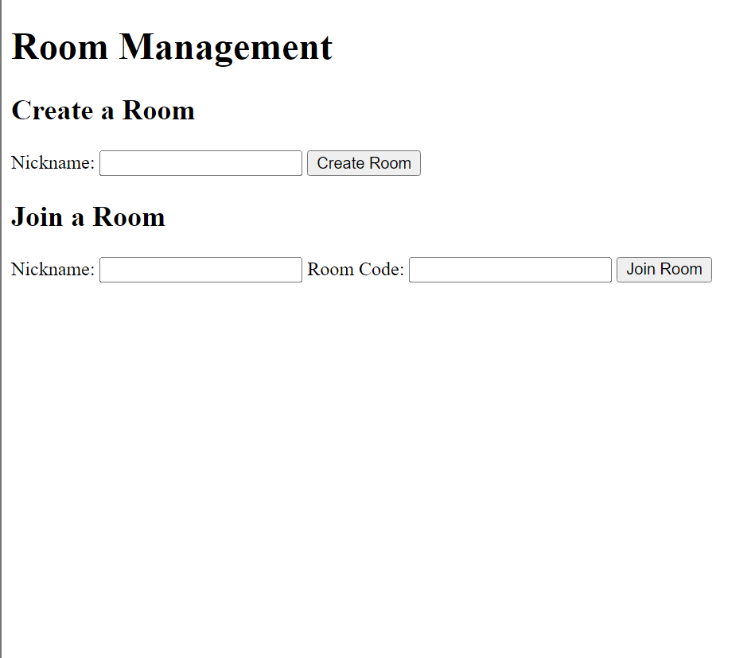
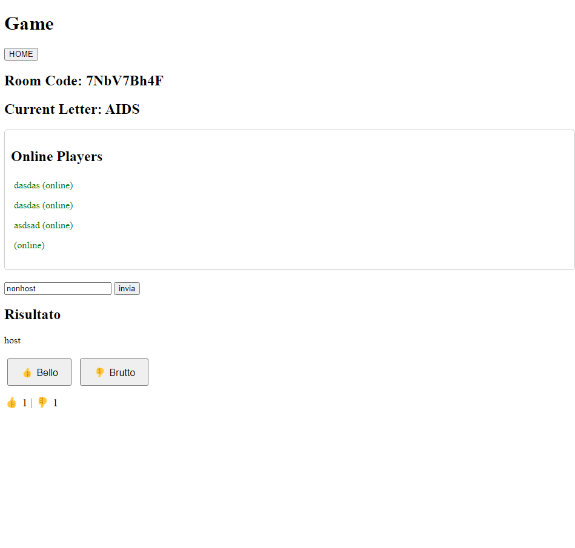

# Acronimi
Un gioco sugli acronimi. 

Sto usando soprattutto Javascript con il framework [Colyseus](https://colyseus.io/).
Il tutto è attualmente hostato localmente ma non dovrebbe essere difficile configurare un server remoto dato che usa Node e WebSocket.

Pagina di Notion:
https://www.notion.so/romanofranceso/Gioco-acronimi-12ada23e29518098abd6c8438e67d2da?pvs=4

## Note
- CI SONO VARI COMMENTI/RIMASUGLI/NOMI STRANI PERCHE STO USANDO COPILOT __
- _Attualmente c'è questo strano problema per cui quando viene creata una stanza l'host si sconnette e riconnette una volta con un id diverso, funziona comunque dato che in teoria il token si salva localmente (?)_ ***IN REALTA POTREBBE ESSERE UNA FUNZIONE DI DEFAULT, QUINDI PER ORA OK, PERO NELLA LSITA DEI GIOCATORI CI SONO DUE HOST***  
 

## DA FARE:
- Testare connessioni multiple contemporanee
- Progettare e applicare UI
- NOMEEEEEEEEEEEEEEEEEEEEEEEEE
- Classifica finale e ripetizione round
- Voti singoli e non due a due
- Update alle immagini README

## Progressi
15/11 - Per adesso sono riuscito a creare un sistema di Creazione/Join stanza con acronimi sincronizzati e anche un bottone che l'host può premere per finire il round.  
16/11 - Ora c'è l'input per gli acronimi, e quando un utente invia un acronimo (max 1) viene salvato in un array, che viene poi mostrato a tutti i giocatori quando l'host preme "End Round"  
17/11 - Ora quando l'host preme il bottone per finire il round si vedono uno alla volta gli acronimi dei giocatori, l'host può premere un bottone per passare al prossimo  
18/11 - Ho creato un'altra branch per evitare casini, sono risucito a fare in modo che i voti siano sincronizzati e in base all'acronimo corrente  
19/11 - Ho inserito una lista di giocatori online nella stanza.  
20/11 - Ora i voti sono sincronizzati  
24/11 - Ora i voti sono associati al nickname e c'è una classifica, ma i voti vanno avanti due a due.  

## Cosa fanno i file
### MyRoom.js
Logica principale della stanza di gioco, gestisce connessioni e disconnessioni, stato del gioco, messaggi, eccetera (ad esempio la generazione di acronimi)
### MyRoomState.js
Definisce la struttura dello stato del gioco, gestisce sincronizzazione tra server e client, contiene il playerschema (vedi docs colyseus). 
### index.js
Punto di ingresso dell'applicazione, avvia il server sulla porta 2567
### app.config.js
Configurazione principale del server, definisce route e middleware, gestisce file statici e playground/monitor di colyseus. Questo file lo ho modificato molto poco.
### index.html
Questo file è la "landing page", puoi scegliere se creare una stanza o connetterti a una esistente

### game.html/game-host.html
Interfaccia di gioco sia per host che per giocatori, ancora molto rudimentale in quanto mostra il codice stanza e l'acronimo sincronizzato e, in caso della versione host, anche il bottone per fermare il round.

### fine.html/fine-host.html
Schermata di intermezzo tra un round e l'altro (o fine?) ***ANCORA DA DEFINIRE SE SERVIRA' O MENO*** ***SPOILER: NO***

### MyRoom_test.js, example.js, eccetera
File che non ho toccato, a scopo di test o configurazione del framework.

_ultima modifica: 24/11/24, 13.41_
